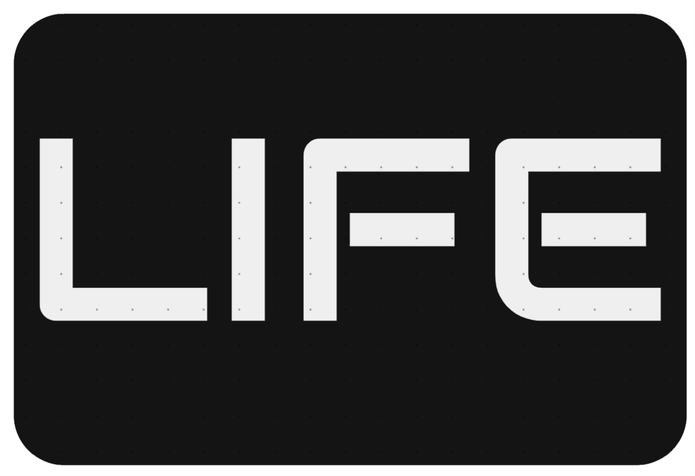
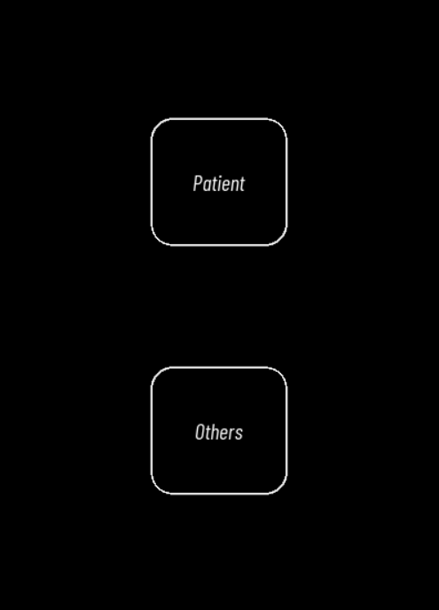
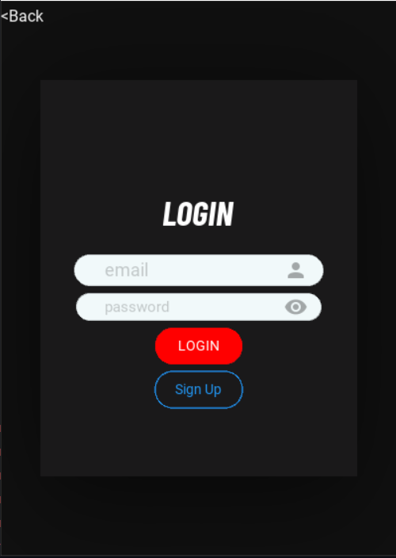
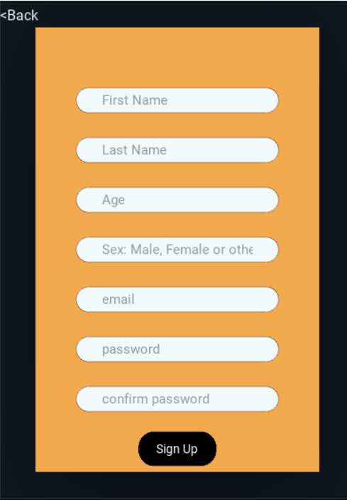
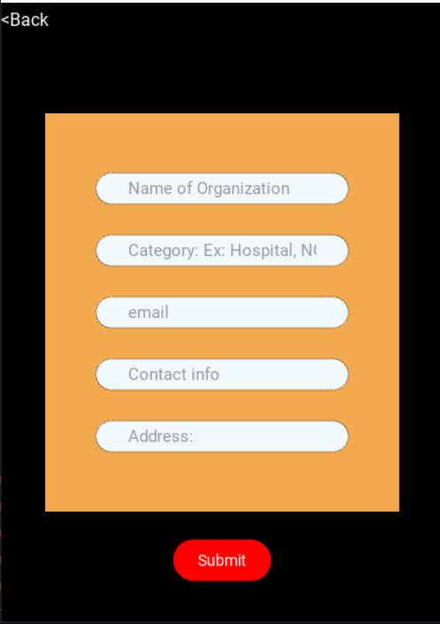

# Life

#### A place where you can find all the hodpitals, vaccine centers, blood banks, NGOs or any other organisation

## How To Use?

- First user is asked whether he/she is a patient or an organisation

##### if the user is a patient he/she is directed to the login screen, where an existing user can sign in or a new user can sign up

- New users taken to SignUp screen are asked the basic requirements

- If the user is an organisation, they select the others option
##### here they fill up the requirements and then click "Submit"

